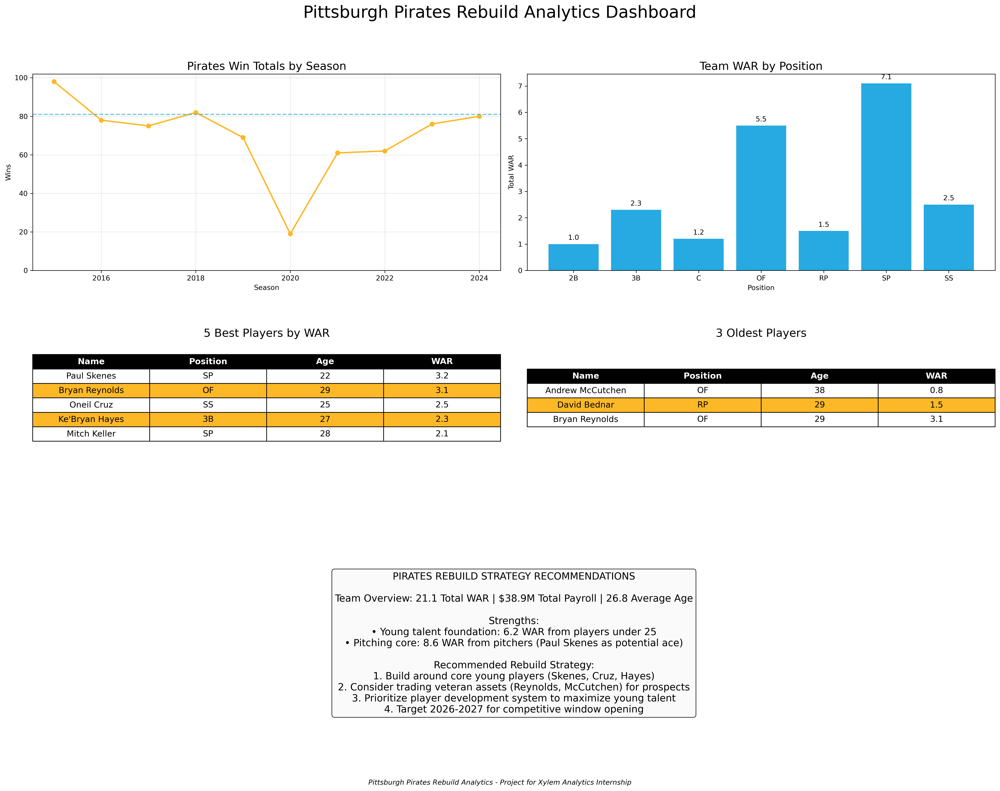

# Pittsburgh Pirates Rebuild Analytics

A data analysis project that evaluates the Pittsburgh Pirates roster and provides strategic recommendations for a franchise rebuild.

## Project Overview

This project analyzes the current Pirates roster, historical performance, and provides data-driven recommendations for rebuilding the franchise. The analysis includes:

- Team performance history
- WAR (Wins Above Replacement) by position
- Top player evaluation
- Roster age analysis
- Strategic rebuild recommendations

## Technologies Used

- Python
- pandas for data analysis
- Matplotlib for data visualization
- Data processing and statistical analysis

## Dashboard

## Key Findings

- Total Team WAR: 21.1
- Total Payroll: $38.9M
- Paul Skenes is the highest WAR player (3.2)
- Strong pitching foundation with young talent

## Files

- `pirates_data.csv`: Current roster data
- `team_history.csv`: Historical team performance
- `pirates_analytics.py`: Python script that generates the dashboard
